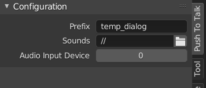

# Push To Talk

Convenient recording of scratch dialog for an edit.

## Usage

In the `Sequencer` header click `Start Recording` to capture your microphone's audio and click again to finish.

### Configuring the Audio Input

If there is more than one microphone available, a specific one can be selected in the recording configuration panel.
Typically, it should start with `sysdefault` or `usb`.

## Installation

1. Download this repository as ZIP file.
2. In Blender's `Edit > Preferences > Add-ons`, click `Install` and select the ZIP.

### Updating

1. Download the newest version ZIP.
2. In Blender's `Edit > Preferences > Add-ons`, find this add-on, expand it, and click `Remove`.
3. Click `Install` and select the ZIP.

Alternatively: this repository can be **cloned** and linked to the `scripts/addons` folder of the Blender executable and be kept up to date with `git pull` without the need to remove/install.

### Requirements
- Blender 2.83 or later.
- Linux system and `ffmpeg`.
