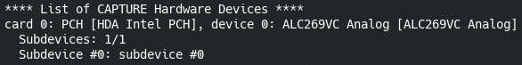

# Push To Talk

Convenient recording of scratch dialog for an edit.

## Usage

In the Sequencer header click `Start Recording` to capture your microphone's audio and click again to finish.

### Configuring the Audio Input
This add-on needs a device number that matches the microphone to use.

In a terminal, list audio devices with `arecord -l`. Example output:

In this case, there is only one device and "0" is the number to use.

In Blender's `Sequencer` view, check the recoding configuration in the sidebar panel.

## Installation

1. Download this repository as ZIP file.
2. In Blender's `Edit > Preferences > Add-ons`, click `Install` and select the ZIP.

### Updating

1. Download the newest version ZIP.
2. In Blender's `Edit > Preferences > Add-ons`, find this add-on, expand it, and click `Remove`.
3. Click `Install` and select the ZIP.

Alternatively: this repository can be **cloned** and linked to the `scripts/addons` folder of the Blender executable and be kept up to date with `git pull` without the need to remove/install.

### Requirements
- Blender 2.83 or later.
- Linux system with `arecord` and `ffmpeg`.
